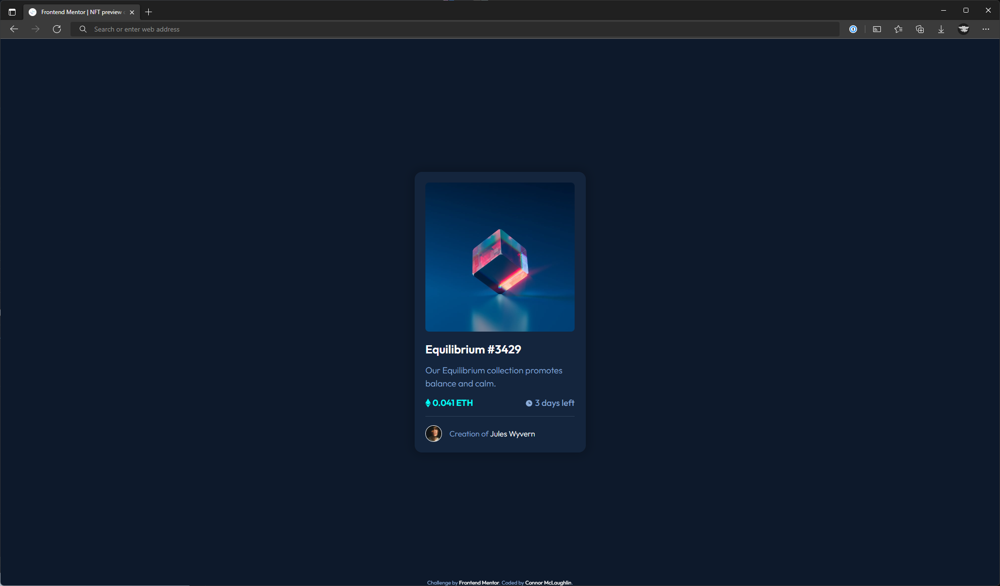
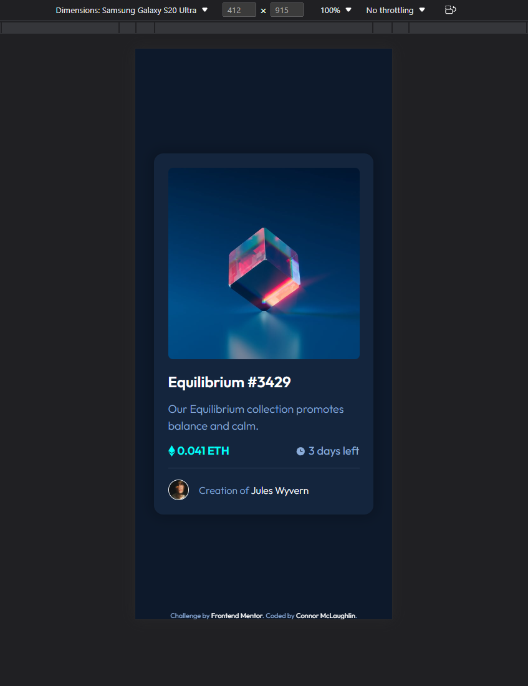

# Frontend Mentor - NFT preview card component solution

This is a solution to the [NFT preview card component challenge on Frontend Mentor](https://www.frontendmentor.io/challenges/nft-preview-card-component-SbdUL_w0U). Frontend Mentor challenges help you improve your coding skills by building realistic projects. 

## Table of contents

- [Overview](#overview)
  - [The challenge](#the-challenge)
  - [Screenshot](#screenshot)
  - [Links](#links)
- [My process](#my-process)
  - [Built with](#built-with)
- [Author](#author)
- [Acknowledgments](#acknowledgments)

## Overview

### The challenge

Users should be able to:

- View the optimal layout depending on their device's screen size
- See hover states for interactive elements

### Screenshot

- Desktop

- Mobile

### Links

- Solution URL: [Frontend Mentor Solution Submission](https://www.frontendmentor.io/solutions/nft-preview-using-scss-and-flexbox-0ccNcynLp5)
- Live Site URL: [GitHub Live Site](https://cbmclaughlin.github.io/FM-NFTPreview/)

## My process

### Built with

- Semantic HTML5 markup
- CSS custom properties
- SCSS Preprocessor
- Flexbox
- Mobile-first workflow

## Author

- Frontend Mentor - [@CBMcLaughlin](https://www.frontendmentor.io/profile/CBMcLaughlin)
- LinkedIn - [Connor McLaughlin](https://www.linkedin.com/in/connor-mclaughlin-3b89a4183/)
